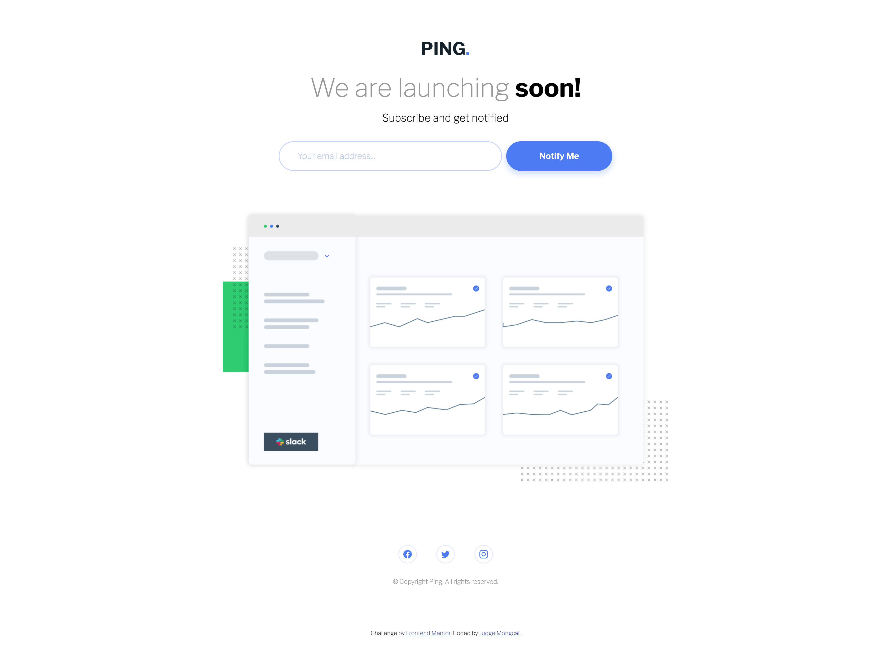
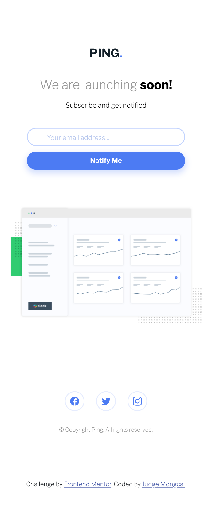

# frontend-project-coming-soon-landing-page
 A single-column coming soon landing page made with HTML, plain CSS, a bit of Bootstrap, and JS for validation of email input.

## Table of contents

- [Overview](#overview)
  - [The challenge](#the-challenge)
  - [Screenshot](#screenshot)
  - [Links](#links)
- [My process](#my-process)
  - [Built with](#built-with)
  - [What I learned](#what-i-learned)
  - [Continued development](#continued-development)
- [Author](#author)

## Overview

### The challenge

Users should be able to:

- View the optimal layout for the site depending on their device's screen size
- See hover states for all interactive elements on the page
- Submit their email address using an `input` field
- Receive an error message when the `form` is submitted if input is empty or is in an incorrect format

### Screenshot

 

### Links

- Solution URL: [https://github.com/judgemongcal/frontend-project-coming-soon-landing-page]
- Live Site URL: [https://sparkling-custard-45beb3.netlify.app/]

## My process

My process started with coding all the HTML elements necessary for this project one by one, and styling them with CSS to allow myself to focus on completing one area of the design before I move on with the next one (divide and conquer approach). This structure is also applied in writing CSS, to allow for other people to easily navigate the code. After the HTML and CSS is set, I then proceeded with adding the email verification function via JS. 

### Built with

- Semantic HTML5 markup
- CSS Bootstrap elements
- CSS custom properties
- Flexbox
- Mobile-first workflow

### What I learned

JS requires a lot of time and repetition to understand. That being said, I still have a long way to go from using JS comfortably in projects. This project also reminded me that in coding, you won't know it all when doing a project but that's okay. You can still build cool stuff while learning things you have no idea about along the way.

### Continued development

For the next projects, I am going to focus more on JS to further improve my understanding and ability to implement it on future projects. I'm also going to try to write less code if possible to make my code more efficient.

## Author

- LinkedIn - [@judgemongcal](https://www.linkedin.com/in/judgemongcal/)
- Frontend Mentor - [@judgemongcal](https://www.frontendmentor.io/profile/judgemongcal)